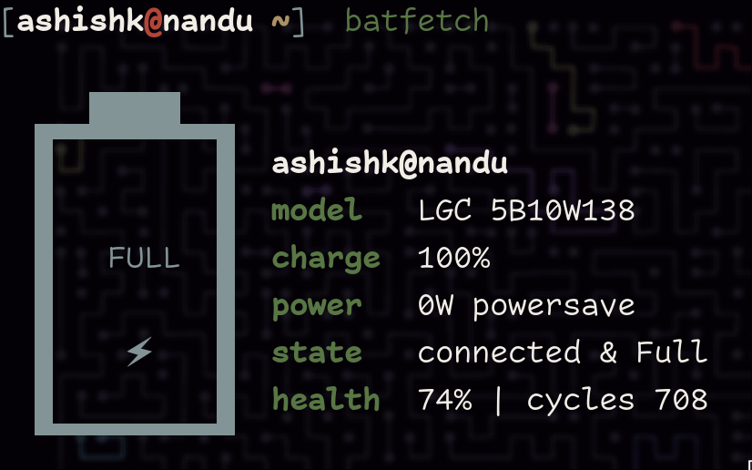

<div align="center">

A super tiny battery information fetch script written in BASH
<a href='#'></img><a/>
<a href='#'></img><a/>
<a href='#'></img><a/>

</div>

# Batfetch
BatFetch is a command-line tool that displays detailed information about the battery of your device in a clean and organized way. The tool is inspired by pfetch, a popular command-line system information tool.

It provides information about the battery model, current charge level, power state, and health status. The tool also displays an ASCII art title that adds a touch of fun to the output.

## Usage:
#### Basic usage:
```
batfetch
```

#### JSON Output:
To obtain detailed information in JSON format, use the -j or --json flag. 
Note that this feature requires the installation of jq on your system.
```
batfetch -j
# or
batfetch --json
```
Make sure to install jq for the JSON output functionality:
```
# On arch based systems*
yay -S jq

# On Debian-based systems
sudo apt-get install jq

# On Red Hat-based systems
sudo yum install jq
```



## Installation:

#### AUR:
```
yay -S batfetch
```
## For manual instalation:

#### To install run  
```
    git clone https://github.com/ashish-kus/batfetch 
    cd batfetch
    sudo make install 
```
#### To uninstall run  
```
    git clone https://github.com/ashish-kus/batfetch 
    cd batfetch
    sudo make uninstall 
```
#### LICENCE

<center>
	GNU GENERAL PUBLIC LICENCE
	version 3, 29 June 2007
</center>

Copyright (C) 2007 Free Software Foundation, Inc. <https://fsf.org/> Everyone is permitted to copy and distribute verbatim copies of this license document, but changing it is not allowed.

